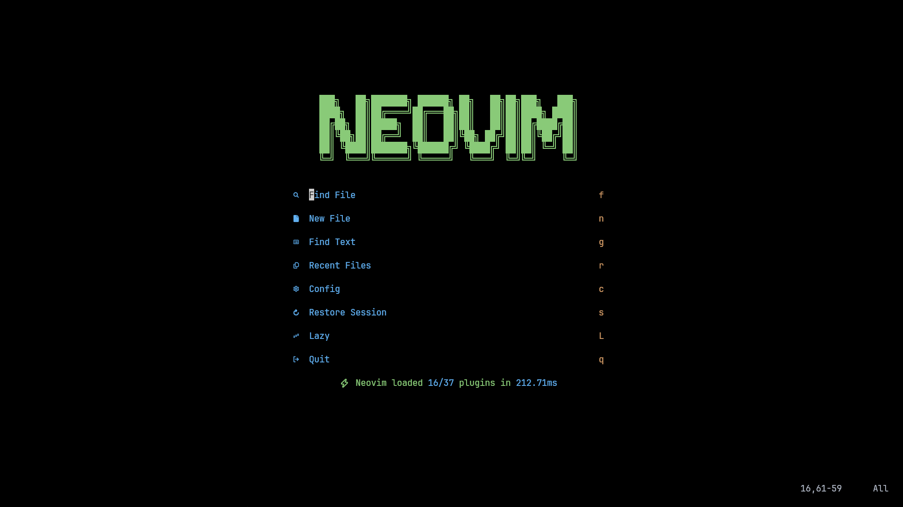

# NEOVIM



### For Linux And MacOS

```
git clone https://github.com/MSA611/NEOVIM ~/.config/nvim --depth 1 && nvim

```

### For Windows

- If You Are Command Propmt (Make Sure You Have Git Installed)

```
git clone https://github.com/MSA611/NEOVIM  %USERPROFILE%\AppData\Local\nvim --depth 1 && nvim
```

- For PowerShell aka pwsh you can use the following command

```
git clone https://github.com/MSA611/NEOVIM  $ENV:USERPROFILE\AppData\Local\nvim && nvim
```

- Please Remove .git File

```
rm -rf ~/.config/nvim/.git
```

### Uninstallation Process For MacOS and Linux

```
rm -rf ~/.config/nvim
rm -rf ~/.local/share/nvim
rm -rf ~/.local/state/nvim

# Flatpak (linux)
rm -rf ~/.var/app/io.neovim.nvim/config/nvim
rm -rf ~/.var/app/io.neovim.nvim/data/nvim
rm -rf ~/.var/app/io.neovim.nvim/.local/state/nvim
```

### Uninstallation Process For Windows

```
# Windows CMD
rd -r ~\AppData\Local\nvim
rd -r ~\AppData\Local\nvim-data


# Windows PowerShell
rm -Force ~\AppData\Local\nvim
rm -Force ~\AppData\Local\nvim-data
```

### Neovim Configuration - Keymap Documentation

This document provides a comprehensive overview of all keymaps configured in this Neovim setup.

## General Keymaps

| Mode | Keymap       | Action                | Description                                           |
| ---- | ------------ | --------------------- | ----------------------------------------------------- |
| n,v  | `<leader>cf` | Format file/selection | Format current file or visual selection using conform |
| n    | `<C-t>`      | Toggle terminal       | Open floating terminal in current file directory      |
| t    | `<C-t>`      | Toggle terminal       | Close floating terminal                               |
| n,v  | `y`          | Yank to clipboard     | Copy to system clipboard                              |

## Navigation Keymaps

| Mode | Keymap   | Action     | Description                                    |
| ---- | -------- | ---------- | ---------------------------------------------- |
| n,x  | `j`      | Smart down | Move down (gj for wrapped lines, j for normal) |
| n,x  | `<Down>` | Smart down | Move down (gj for wrapped lines, j for normal) |
| n,x  | `k`      | Smart up   | Move up (gk for wrapped lines, k for normal)   |
| n,x  | `<Up>`   | Smart up   | Move up (gk for wrapped lines, k for normal)   |

## Window Navigation

| Mode | Keymap  | Action             | Description                 |
| ---- | ------- | ------------------ | --------------------------- |
| n    | `<C-h>` | Go to left window  | Move cursor to left window  |
| n    | `<C-j>` | Go to lower window | Move cursor to lower window |
| n    | `<C-k>` | Go to upper window | Move cursor to upper window |
| n    | `<C-l>` | Go to right window | Move cursor to right window |

## Window Resizing

| Mode | Keymap      | Action          | Description                 |
| ---- | ----------- | --------------- | --------------------------- |
| n    | `<C-Up>`    | Increase height | Increase window height by 2 |
| n    | `<C-Down>`  | Decrease height | Decrease window height by 2 |
| n    | `<C-Left>`  | Decrease width  | Decrease window width by 2  |
| n    | `<C-Right>` | Increase width  | Increase window width by 2  |

## Line Movement

| Mode | Keymap  | Action              | Description                          |
| ---- | ------- | ------------------- | ------------------------------------ |
| n    | `<A-j>` | Move line down      | Move current line down               |
| n    | `<A-k>` | Move line up        | Move current line up                 |
| i    | `<A-j>` | Move line down      | Move current line down (insert mode) |
| i    | `<A-k>` | Move line up        | Move current line up (insert mode)   |
| v    | `<A-j>` | Move selection down | Move selected lines down             |
| v    | `<A-k>` | Move selection up   | Move selected lines up               |

## Buffer Management

| Mode | Keymap       | Action                 | Description                |
| ---- | ------------ | ---------------------- | -------------------------- |
| n    | `<S-h>`      | Previous buffer        | Switch to previous buffer  |
| n    | `<S-l>`      | Next buffer            | Switch to next buffer      |
| n    | `[b`         | Previous buffer        | Switch to previous buffer  |
| n    | `]b`         | Next buffer            | Switch to next buffer      |
| n    | `<leader>bb` | Switch to other buffer | Switch to last used buffer |
| n    | `<leader>\`` | Switch to other buffer | Switch to last used buffer |

## Window Management

| Mode | Keymap       | Action           | Description                       |
| ---- | ------------ | ---------------- | --------------------------------- |
| n    | `<leader>-`  | Split horizontal | Split window horizontally (below) |
| n    | `<leader>\|` | Split vertical   | Split window vertically (right)   |
| n    | `<leader>wd` | Delete window    | Close current window              |

## Which-Key Groups (Leader Key Prefixes)

| Prefix          | Group                | Description                 |
| --------------- | -------------------- | --------------------------- |
| `<leader><tab>` | tabs                 | Tab management commands     |
| `<leader>c`     | code                 | Code-related actions        |
| `<leader>d`     | debug                | Debugging commands          |
| `<leader>dp`    | profiler             | Profiler commands           |
| `<leader>f`     | file/find            | File operations and search  |
| `<leader>g`     | git                  | Git operations              |
| `<leader>gh`    | hunks                | Git hunk operations         |
| `<leader>q`     | quit/session         | Quit and session management |
| `<leader>s`     | search               | Search operations           |
| `<leader>u`     | ui                   | UI toggles and settings     |
| `<leader>x`     | diagnostics/quickfix | Diagnostics and quickfix    |
| `<leader>b`     | buffer               | Buffer management           |
| `<leader>w`     | windows              | Window management           |

# Special Keymaps

| Mode | Keymap         | Action               | Description                                   |
| ---- | -------------- | -------------------- | --------------------------------------------- |
| n    | `<leader>?`    | Show buffer keymaps  | Display which-key for current buffer          |
| n    | `<C-w><space>` | Window hydra mode    | Enter window management mode                  |
| n    | `gx`           | Open with system app | Open file/URL with default system application |

## Navigation Groups

| Prefix | Group    | Description                  |
| ------ | -------- | ---------------------------- |
| `[`    | prev     | Previous navigation commands |
| `]`    | next     | Next navigation commands     |
| `g`    | goto     | Goto commands                |
| `gs`   | surround | Surround operations          |
| `z`    | fold     | Folding operations           |

## Mode Legend

- **n** = Normal mode
- **v** = Visual mode
- **i** = Insert mode
- **t** = Terminal mode
- **x** = Visual block mode

## Important Notes

- **Leader key** is set to `SPACE`
- Most keymaps support count prefixes (e.g., `3j` moves 3 lines down)
- Window navigation uses `Ctrl + hjkl` for intuitive movement
- Buffer navigation uses `Shift + hl` for quick switching
- `Alt + jk` for line movement works in all modes
- Terminal toggle works from both normal and terminal modes
- Many additional keymaps are available through which-key groups - press `<leader>` followed by any group prefix to see available options

## Plugin-Specific Keymaps

### NeoTree

NeoTree keymaps are configured within the plugin itself. Open NeoTree and press `?` to see all available keymaps.

### Terminal (ToggleTerm)

- `<C-t>` - Toggle floating terminal in current file's directory
- Works from both normal mode and within the terminal

### Formatting (Conform)

- `<leader>cf` - Format current file or visual selection

## Configuration Files

- To Make Snacks Picker to show hidden files use Alt+h and to show the .gitignore files Alt+i
- Main keymap configuration: `lua/config/keymaps.lua`
- Which-key configuration: `lua/plugins/whichKey.lua`
- Plugin-specific keymaps are defined in their respective plugin files in `lua/plugins/`
